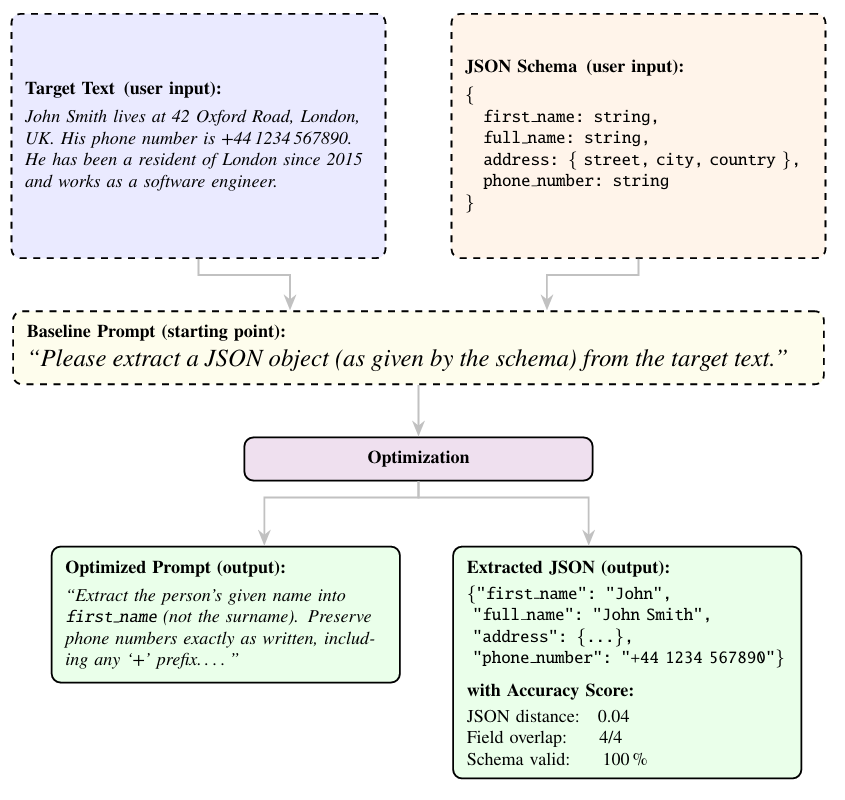

# optimize-prompt-json

Iterative LLM prompt optimization for JSON extraction from text.

Given a JSON schema and a sample text, this tool automatically refines the extraction prompt through iterative optimization, evaluating extraction quality with synthetically generarated training data, and improving the prompt by learning from the previous steps.

## How it works

<p align="center">
  
</p>

1. **Generate** random JSON instances from your schema
2. **Transform** each JSON into natural-language text (using your sample as a style reference)
3. **Extract** JSON back from the synthetic text using the current prompt
4. **Evaluate** extraction quality (field overlap, value similarity, schema validity)
5. **Refine** the prompt based on lessons learned from errors
6. **Repeat** until quality targets are met or max steps reached

The output is an **optimized extraction prompt** that you can use with any LLM to extract structured JSON from text matching your schema.


## Installation

The easiest way to install the latest version directly from GitHub:

```bash
pip install --upgrade git+https://github.com/rabiehami/optimize_prompt_json.git
```

## Quick start


```python
from optimize_prompt_json import OptimizationConfig, run_optimization
import asyncio

config = OptimizationConfig(
    initial_prompt="Please extract from the text below the data described in the schema below as a JSON object."
    text="The weather in Paris is nice tomorrow. It will have 5 degrees.",
    schema={"type": "object", "properties": {"city": {"type": "string"}, "temperature": {"type": "number"}}},
    llm_model="groq/llama-3.1-8b-instant",
    api_key="your_api_key_here",
)
result = asyncio.run(run_optimization(config))
print(result["optimized_prompt"])
```

## Configuration

All parameters are passed via `OptimizationConfig`:

| Parameter              | Default                          | Description                              |
|------------------------|----------------------------------|------------------------------------------|
| `schema`               | *(required)*                     | JSON schema as a dict                    |
| `text`                 | *(required)*                     | Text to extract JSON from                |
| `api_key`              | `""`                             | API key for your LLM provider            |
| `api_key_text_gen`     | same as `api_key`               | API key for text generation model        |
| `api_key_optimizer`    | same as `api_key`               | API key for prompt refinement model      |
| `llm_model`            | `groq/llama-3.1-8b-instant`     | LLM for JSON generation and extraction   |
| `llm_text_gen_model`   | same as `llm_model`             | LLM for synthetic text generation        |
| `llm_optimizer_model`  | same as `llm_model`             | LLM for prompt refinement                |
| `batch_size`           | `10`                            | Synthetic examples per step              |
| `max_steps`            | `10`                            | Maximum optimization steps               |
| `min_steps`            | `0`                             | Minimum steps before early stopping      |
| `temp_json`            | `0.5`                           | Temperature for JSON generation          |
| `temp_extract`         | `0.0`                           | Temperature for JSON extraction          |
| `temp_article`         | `0.0`                           | Temperature for text generation          |
| `field_overlap_target` | `0.99`                          | Stop when field overlap exceeds this     |
| `json_distance_target` | `0.01`                          | Stop when JSON distance drops below      |
| `schema_valid_target`  | `0.99`                          | Minimum schema validity rate             |
| `rollback_threshold`   | `0.01`                          | Score drop that triggers rollback        |
| `rate_limit_delay`     | `0.0`                           | Delay between API requests (seconds)     |
| `optimize`             | `True`                          | When `True`, the pipeline runs the iterative prompt-refinement loop (generate → evaluate → refine). When `False`, the full pipeline machinery still executes (DB logging, metrics tracking, synthetic data generation), but the prompt-refinement step is skipped — the prompt stays unchanged across all steps. This is useful for benchmarking the baseline prompt through the pipeline. **Note:** this is different from running a standalone baseline extraction outside the pipeline (see [Baseline-only example](#baseline-only-example) below). |
| `db_url`               | `None`                          | SQLite URL for run persistence (e.g. `sqlite:///runs.db`); `None` uses in-memory storage (no file written) |
| `log_dir`              | `None`                          | Directory for log files (e.g. `"logs"`); `None` disables file logging |
| `quiet`                | `False`                         | Suppress step-by-step console output     |
| `initial_prompt`       | see below                       | Initial extraction prompt (baseline); if not set, uses the default baseline prompt |

## Result dictionary

`run_optimization()` returns a dict with the following keys:

| Key                 | Description                                          |
|---------------------|------------------------------------------------------|
| `run_id`            | Unique identifier for this optimization run          |
| `optimized_prompt`  | The refined extraction prompt                        |
| `num_steps`         | Number of optimization steps completed               |
| `final_score`       | Composite quality score of the final step            |
| `step_0_score`      | Composite quality score of the first step            |
| `baseline_json`     | JSON extracted using the unoptimized prompt          |
| `optimized_json`    | JSON extracted using the optimized prompt            |
| `total_cost`        | Total API cost in USD                                |
| `total_runtime`     | Total runtime in seconds                             |

## Baseline-only example

If you just want to extract JSON from text with the baseline prompt — without any optimization or pipeline overhead — you can call the extraction helpers directly:

```python
import json
import litellm
from optimize_prompt_json.prompts import extract_json_from_text

schema = {"type": "object", "properties": {"city": {"type": "string"}, "temperature": {"type": "number"}}}
text = "The weather in Paris is nice tomorrow. It will have 5 degrees."

# Build the extraction prompt (uses the default baseline prompt)
prompts = extract_json_from_text([text], schema)

response = litellm.completion(
    model="groq/llama-3.1-8b-instant",
    messages=[{"role": "user", "content": prompts[0]}],
    api_key="your_api_key_here",
)
print(response.choices[0].message.content)
```

This bypasses the pipeline entirely — no synthetic data generation, no metrics, no DB logging. It is equivalent to what the pipeline does at step 0 before any refinement begins.

## Supported LLM providers

Any model supported by [litellm](https://docs.litellm.ai/docs/providers) works.

**Recommended:** Groq models (e.g., `groq/llama-3.1-8b-instant`) are a good choice due to their high rate limits and fast inference.

## Output

The library produces:

- **Console output**: Step-by-step progress and quality comparison (unless `quiet=True`)
- **SQLite database**: Full run history and metrics. By default, stored in memory only (no file written). Set `db_url` to a file path (e.g. `sqlite:///runs.db`) to persist results across runs.
- **`logs/`**: Detailed log files for debugging (set `log_dir=None` to disable)

## License

MIT
